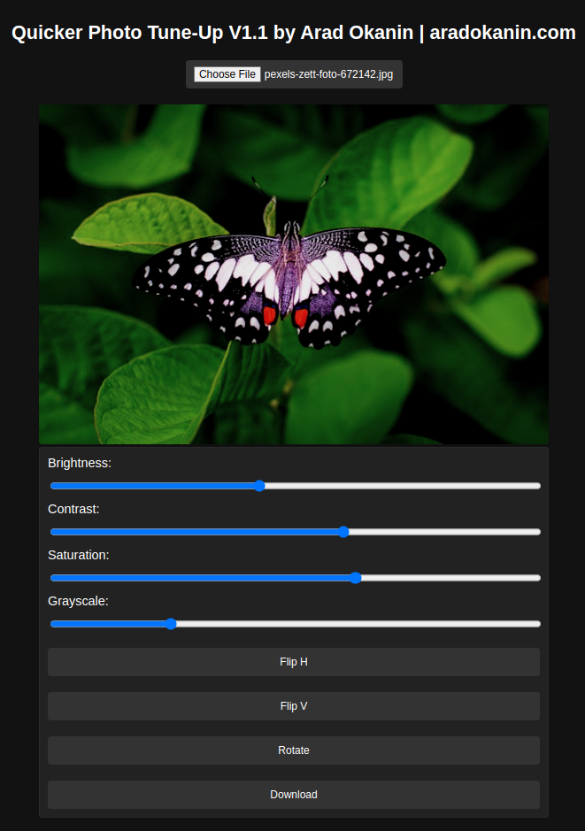

# Quicker Photo Tune-Up

Quicker Photo Tune-Up is a simple yet powerful web application designed to provide quick and easy photo adjustments right in your browser. With a user-friendly interface, you can upload a photo and apply various enhancements, such as adjusting brightness, contrast, saturation, and more. Once you're satisfied with the edits, you can download the enhanced image to your local machine.

## Features

- **Upload and Preview**: Easily upload any image to start editing.
- **Adjust Brightness**: Modify the brightness to make your photo look its best.
- **Alter Contrast**: Adjust the contrast to enhance the depth of your images.
- **Change Saturation**: Increase or decrease the saturation to get the perfect color balance.
- **Apply Grayscale**: Convert your photo to grayscale with a simple slider.
- **Flip and Rotate**: Flip your photo horizontally or vertically and rotate as needed.
- **Responsive Design**: Works on both desktop and mobile devices for on-the-go editing.
- **Download**: Download the edited image with all the changes applied.

## Getting Started

To get a local copy up and running follow these simple steps.

### Prerequisites

- Node.js
- npm (Node Package Manager)

### Installation

1. Clone the repository:

```sh
git clone https://github.com/yourusername/quicker-photo-tune-up.git
```

2. Navigate to the project directory:

```sh
cd quicker-photo-tune-up
```

3. Install NPM packages:

```sh
npm install
```

4. Start the app in development mode:
```sh
npm run dev
```

The app will start running on http://localhost:5173. Open this URL in your browser to use the app.


## Usage

1. Click on the "Choose File" button to upload your image.
2. Use the provided sliders to adjust brightness, contrast, saturation, and grayscale.
3. Use the buttons to flip or rotate the image as needed.
4. Click on the "Download" button to save the edited image to your device.


## Contributing
Contributions are what make the open-source community such an amazing place to learn, inspire, and create. Any contributions you make are greatly appreciated.

1. Fork the Project
2. Create your Feature Branch (git checkout -b feature/AmazingFeature)
3. Commit your Changes (git commit -m 'Add some AmazingFeature')
4. Push to the Branch (git push origin feature/AmazingFeature)
5. Open a Pull Request

## SCreenshot

